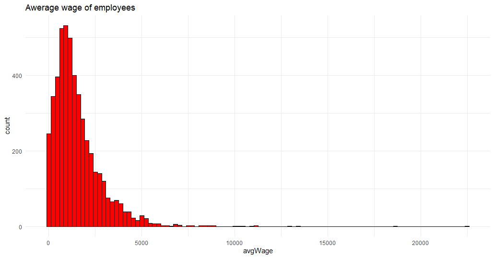

# R Laboratorinis darbas: duomenų vizualizacija

| Variantas | ecoActCode |
|------------- | ------------- |
|9   | 702200 |

### 1. Užduotis

Atsakymas:

Išvados: Konsultacinės verslo ir kito valdymo veiklos įmonėse vidutinis atlyginimas yra 1529 eurai, didžiausias atlyginimas siekia 22488 eurus.

### 2. Užduotis

Atsakymas:

Išvados: 5 įmonės, kurių vidutinis darbp užmokestis buvo didžiausias yra: UAB "AKSO FUND", UAB "CONCRETUS GROUP", 
UAB "PARKDEMA", UAB "JTI BALTIC", UAB "MERCK SHARP & DOHME". Įmonių UAB "MERCK SHARP & DOHME" ir UAB "CONCRETUS GROUP"
atlyginimai pirmajame metų ketvirtyje ryškiai iššoko į viršų, vėliau buvo apylygūs. Taip pat verta pastebėti, jog 
nuo metų vidurio visų įmonių (išskyrus UAB "PARKDEMA") atlyginimas buvo tolygus, o minėtoje įmonėje truputį svyravo.

### 3. Užduotis

Atsakymas:

Išvados: Lyginant prieš tai minėtų įmonių apdraustų darbuotojų skaičių, galima pastebėti, jog daugiausia tokių 
darbuotojų turėjo įmonė UAB "JTI BALTIC", dešimtimi mažiau UAB "MERCK SHARP & DOHME", o likusios įmonės apdraustų 
darbuotojų turėjo mažiau nei 15. Mažiausiai apdraustų darbuotojų (7) buvo įmonėje UAB "PARKDEMA".

### 4. Užduotis

Shiny R aplikacijos nuotrauka:

 
